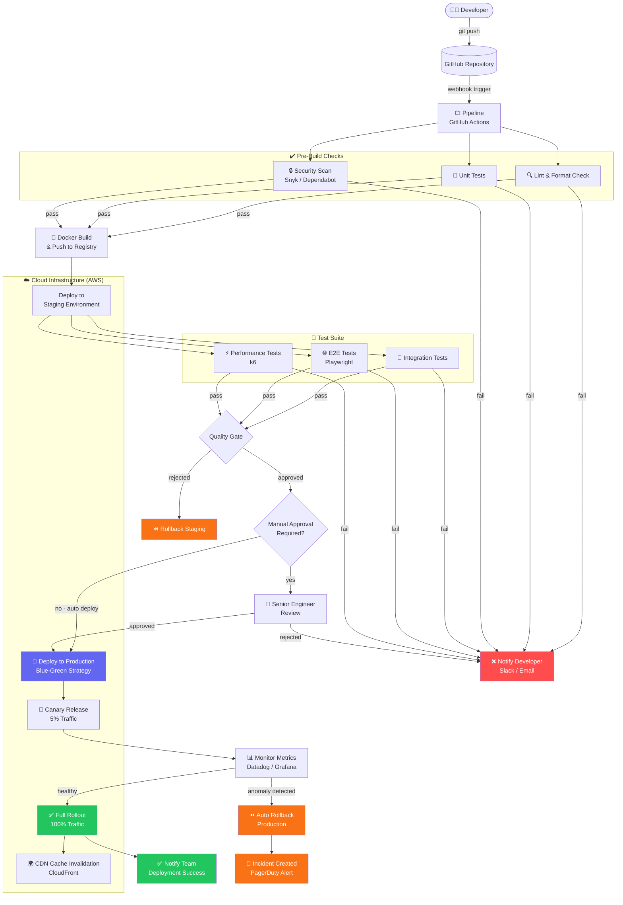

# Mermaid Diagram

## Mermaid flowchart

```mermaid
flowchart TD
    DEV([👨‍💻 Developer]) -->|git push| REPO[(GitHub Repository)]

    REPO -->|webhook trigger| CI[CI Pipeline\nGitHub Actions]

    CI --> LINT[🔍 Lint & Format Check]
    CI --> UNIT[🧪 Unit Tests]
    CI --> SEC[🔒 Security Scan\nSnyk / Dependabot]

    LINT -->|pass| BUILD
    UNIT -->|pass| BUILD
    SEC -->|pass| BUILD

    LINT -->|fail| NOTIFY_FAIL[❌ Notify Developer\nSlack / Email]
    UNIT -->|fail| NOTIFY_FAIL
    SEC -->|fail| NOTIFY_FAIL

    BUILD[🐳 Docker Build\n& Push to Registry]

    BUILD --> STAGING_DEPLOY[Deploy to\nStaging Environment]

    STAGING_DEPLOY --> INT_TEST[🔗 Integration Tests]
    STAGING_DEPLOY --> E2E[🌐 E2E Tests\nPlaywright]
    STAGING_DEPLOY --> PERF[⚡ Performance Tests\nk6]

    INT_TEST -->|pass| GATE{Quality Gate}
    E2E -->|pass| GATE
    PERF -->|pass| GATE

    INT_TEST -->|fail| NOTIFY_FAIL
    E2E -->|fail| NOTIFY_FAIL
    PERF -->|fail| NOTIFY_FAIL

    GATE -->|approved| APPROVAL{Manual Approval\nRequired?}
    GATE -->|rejected| ROLLBACK_STG[⏪ Rollback Staging]

    APPROVAL -->|yes| REVIEW[👀 Senior Engineer\nReview]
    APPROVAL -->|no - auto deploy| PROD_DEPLOY

    REVIEW -->|approved| PROD_DEPLOY[🚀 Deploy to Production\nBlue-Green Strategy]
    REVIEW -->|rejected| NOTIFY_FAIL

    PROD_DEPLOY --> CANARY[🐤 Canary Release\n5% Traffic]
    CANARY --> MONITOR[📊 Monitor Metrics\nDatadog / Grafana]

    MONITOR -->|healthy| FULL_ROLLOUT[✅ Full Rollout\n100% Traffic]
    MONITOR -->|anomaly detected| ROLLBACK_PROD[⏪ Auto Rollback\nProduction]

    FULL_ROLLOUT --> CDN[🌍 CDN Cache Invalidation\nCloudFront]
    FULL_ROLLOUT --> NOTIFY_OK[✅ Notify Team\nDeployment Success]

    ROLLBACK_PROD --> INCIDENT[🚨 Incident Created\nPagerDuty Alert]

    subgraph Infra ["☁️ Cloud Infrastructure (AWS)"]
        STAGING_DEPLOY
        PROD_DEPLOY
        CANARY
        FULL_ROLLOUT
        CDN
    end

    subgraph Testing ["🧪 Test Suite"]
        INT_TEST
        E2E
        PERF
    end

    subgraph Checks ["✔️ Pre-Build Checks"]
        LINT
        UNIT
        SEC
    end

    style NOTIFY_FAIL fill:#ff4d4d,color:#fff
    style NOTIFY_OK fill:#22c55e,color:#fff
    style INCIDENT fill:#f97316,color:#fff
    style ROLLBACK_PROD fill:#f97316,color:#fff
    style ROLLBACK_STG fill:#f97316,color:#fff
    style PROD_DEPLOY fill:#6366f1,color:#fff
    style FULL_ROLLOUT fill:#22c55e,color:#fff
```

EOF